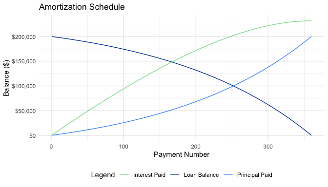

<!-- README.md is generated from README.Rmd. Please edit that file -->

# mortgage

<!-- badges: start -->
<!-- badges: end -->

The goal of mortgage is to help understand the true cost of a mortgage.
It also can help you easily compare between different mortgages. It is
based on the [Python library of the same
name](https://mortgage.readthedocs.io/en/latest/). The package is built
using [R6](https://r6.r-lib.org/).

## Installation

You can install the development version of mortgage from
[GitHub](https://github.com/) with:

``` r
# install.packages("devtools")
devtools::install_github("parmsam/mortgage")
```

## Example

This is a basic example which shows you how to solve a common problem:

``` r
library(mortgage)
# Example usage  
loan <- Loan$new(principal=200000, interest=.06, term=30)
loan 
#> <Loan principal=200000.00, interest=0.06, term=30.0>
```

``` r
loan$summarize()
#> Home price:               $  200000.00
#> Downpayment:              $       0.00
#> Original Balance:         $  200000.00
#> Interest Rate:                    6.00%
#> APY:                              6.17%
#> APR:                              6.00%
#> Term:                             30.0 years
#> Monthly Payment:          $    1199.10
#> 
#> Total principal payments: $  200000.00
#> Total interest payments:  $  231677.04
#> Total payments:           $  431677.04
#> Interest to Principal:          115.80%
#> Years to pay:                     30.0
```

``` r
loan$amortize()
#> # A tibble: 360 × 7
#>    number payment interest principal total_interest total_principal balance
#>     <int>   <dbl>    <dbl>     <dbl>          <dbl>           <dbl>   <dbl>
#>  1      1   1199.    1000       199.          1000             199. 199801.
#>  2      2   1199.     999       200.          1999             399. 199601.
#>  3      3   1199.     998       201.          2997.            600. 199400.
#>  4      4   1199.     997       202.          3994.            802. 199198.
#>  5      5   1199.     996.      203.          4990            1006. 198994.
#>  6      6   1199.     995.      204.          5985.           1210. 198790.
#>  7      7   1199.     994.      205.          6979.           1415. 198585.
#>  8      8   1199.     993.      206.          7972.           1621. 198379.
#>  9      9   1199.     992.      207.          8964.           1828. 198172.
#> 10     10   1199.     991.      208.          9955.           2036. 197964.
#> # ℹ 350 more rows
```

You can also plot the amortization schedule of the loan object using the
`plot` method. And you can get the tipping point of the loan.

``` r
plot(loan) #OR loan$plot()
```



``` r

loan$tipping_point()
#> [1] 223
```

## Compare loan objects

``` r
# Create some Loan objects
loan1 <- Loan$new(principal = 100000, interest = 0.05, term = 30, term_unit = "years", compounded = "monthly")
loan2 <- Loan$new(principal = 150000, interest = 0.04, term = 15, term_unit = "years", compounded = "monthly")
loan3 <- Loan$new(principal = 200000, interest = 0.045, term = 20, term_unit = "years", compounded = "monthly")
# Create a LoanComparison object
loan_comparison <- LoanComparison$new(loans = list(loan1, loan2, loan3))
loan_comparison
#> Loan Comparison Object
#> Loan 1: <Loan principal=100000.00, interest=0.05, term=30.0>
#> Loan 2: <Loan principal=150000.00, interest=0.04, term=15.0>
#> Loan 3: <Loan principal=200000.00, interest=0.04, term=20.0>
```

``` r
# Compare total interest
total_interest_comparison <- loan_comparison$compare_total_interest()
print(total_interest_comparison)
#> # A tibble: 3 × 2
#>    Loan TotalInterest
#>   <int>         <dbl>
#> 1     1        93257.
#> 2     2        49716.
#> 3     3       103672.
# Compare monthly payments
monthly_payments_comparison <- loan_comparison$compare_monthly_payments()
print(monthly_payments_comparison)
#> # A tibble: 3 × 2
#>    Loan MonthlyPayment
#>   <int>          <dbl>
#> 1     1           537.
#> 2     2          1110.
#> 3     3          1265.
# Compare total payments
total_payments_comparison <- loan_comparison$compare_total_payments()
print(total_payments_comparison)
#> # A tibble: 3 × 2
#>    Loan TotalPayments
#>   <int>         <dbl>
#> 1     1       193257.
#> 2     2       199716.
#> 3     3       303672.
```

``` r
# Print a summary of the loan comparison
loan_comparison$summarize()
#> Loan Comparison Summary:
#> Total Interest:
#> # A tibble: 3 × 2
#>    Loan TotalInterest
#>   <int>         <dbl>
#> 1     1        93257.
#> 2     2        49716.
#> 3     3       103672.
#> 
#> Monthly Payments:
#> # A tibble: 3 × 2
#>    Loan MonthlyPayment
#>   <int>          <dbl>
#> 1     1           537.
#> 2     2          1110.
#> 3     3          1265.
#> 
#> Total Payments:
#> # A tibble: 3 × 2
#>    Loan TotalPayments
#>   <int>         <dbl>
#> 1     1       193257.
#> 2     2       199716.
#> 3     3       303672.
#> 
#> Total Payments Difference Matrix:
#>           1         2         3
#> 1      0.00  -6459.38 -110415.0
#> 2   6459.38      0.00 -103955.7
#> 3 110415.04 103955.66       0.0
```
